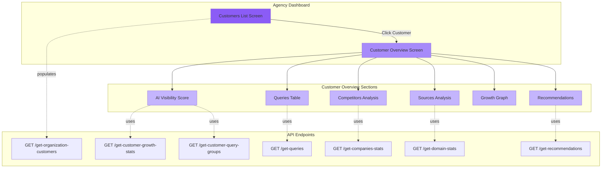

# Building an Agency Dashboard

This guide demonstrates how to use the Mindshare API to build a dashboard that allows agencies to manage multiple customers and view detailed insights for each one.

## Dashboard Architecture



## Dashboard Structure

Your agency dashboard will have two main screens:

1. **Customers List Screen** - Overview of all your customers
2. **Customer Detail Screen** - In-depth analysis with 6 key sections:
   - AI Visibility Score & Breakdown
   - Competitors Analysis
   - Queries Performance
   - Sources Analysis
   - Growth Trends
   - Strategic Recommendations

---

## Screen 1: Agency Customers Overview

Display all customers under your organization with key information.

### Endpoint: `POST /get-organization-customers`

Use this endpoint to populate your customers list.

**What you'll display:**
- Customer ID
- Customer name (clickable to open detail screen)
- Created date
- Last scan date
- Next scheduled scan
- Payment status (paying vs trial)
- Quick action: "View Dashboard" button

```bash
curl -X POST "https://api.mindshare.so/customer/v1/get-organization-customers" \
  -H "X-API-Key: your-api-key" \
  -H "Content-Type: application/json" \
  -d '{"organizationID": 123}'
```

**Response Structure:**
```json
{
  "data": [
    {
      "id": 4896,
      "name": "Quack",
      "created_time": "2025-09-27T12:15:00.000Z",
      "last_scan_date": "2025-09-28T00:00:00.000Z",
      "next_scheduled_run": null,
      "paying_customer": false,
      "website_url": "https://www.quack.ai",
      "view_report_url": "/report/LAQX4896PBXT"
    }
  ],
  "version": "18.2.1",
  "env": "development"
}
```

**Implementation Example:**

```javascript
async function loadCustomers(organizationID) {
  const response = await fetch('/get-organization-customers', {
    method: 'POST',
    headers: {
      'X-API-Key': 'your-api-key',
      'Content-Type': 'application/json'
    },
    body: JSON.stringify({ organizationID })
  });
  
  const data = await response.json();
  
  // Render customer list with columns:
  // ID, NAME, CREATED, LAST SCAN, NEXT SCAN, STATUS
  return data;
}
```

---

## Screen 2: Customer Detail Overview

When a user clicks on a customer, show a comprehensive overview with multiple sections.

### Components Overview

Your customer detail screen should display:

1. **AI Visibility Score** (large circular indicator)
2. **Score Breakdown by Query Group** 
3. **Competitors Analysis** (ranking and bar chart)
4. **Recent Queries** (which queries led to mentions)
5. **Sources** (domains and articles)
6. **Growth Graph** (trend over time)
7. **Strategic Recommendations** (actionable insights for improvement)

---

## Loading Customer Detail Screen Data

When a user clicks "View Dashboard" for a specific customer, you'll need to load several endpoints in parallel to populate all sections.

### Required Endpoints

To build the complete customer overview screen, you'll need:

<CodeGroup>

```javascript 1. Get Query Groups & Latest Execution
// First, get all query groups and find the latest execution
const queryGroups = await fetch('/get-customer-query-groups', {
  method: 'POST',
  headers: { 'X-API-Key': 'your-api-key', 'Content-Type': 'application/json' },
  body: JSON.stringify({ customerID: 4896 })
});

const data = await queryGroups.json();
const latestExecution = data.data[0].executions[0].id;

return { queryGroups: data.data, latestExecution };
```

```javascript 2. Get Growth Stats
const growthStats = await fetch('/get-customer-growth-stats', {
  method: 'POST',
  headers: { 'X-API-Key': 'your-api-key', 'Content-Type': 'application/json' },
  body: JSON.stringify({ customerID: 4896 })
});

return await growthStats.json();
```

```javascript 3. Get Recent Queries
const queries = await fetch('/get-queries', {
  method: 'POST',
  headers: { 'X-API-Key': 'your-api-key', 'Content-Type': 'application/json' },
  body: JSON.stringify({ 
    customerID: 4896, 
    executionID: 10399  // Latest execution
  })
});

return await queries.json();
```

```javascript 4. Get Competitors & Sources
const [companies, domains] = await Promise.all([
  fetch('/get-companies-stats', {
    method: 'POST',
    headers: { 'X-API-Key': 'your-api-key', 'Content-Type': 'application/json' },
    body: JSON.stringify({ customerID: 4896, executionID: 10399 })
  }),
  fetch('/get-domain-stats', {
    method: 'POST',
    headers: { 'X-API-Key': 'your-api-key', 'Content-Type': 'application/json' },
    body: JSON.stringify({ customerID: 4896, executionID: 10399 })
  })
]);

return {
  competitors: await companies.json(),
  sources: await domains.json()
};
```

```javascript 5. Get Recommendations
const recommendations = await fetch('/get-recommendations', {
  method: 'POST',
  headers: { 'X-API-Key': 'your-api-key', 'Content-Type': 'application/json' },
  body: JSON.stringify({ customerID: 4896 })
});

return await recommendations.json();
```

</CodeGroup>

---

## Section Descriptions

### AI Visibility Score
Calculate the overall visibility score by averaging the latest scores from all query groups using `/get-customer-growth-stats` and `/get-customer-query-groups`.

### Competitors Analysis
Display ranking and bar chart of competitors using `/get-companies-stats`.

### Queries Section
Show table of queries with mention status over different scan dates using `/get-queries`.

### Sources Analysis
Display domains with categories, impact percentages, and trends using `/get-domain-stats`.

### Growth Graph
Display line graph with toggle between "Per Scan" (individual scores) and "Overview" (30-day rolling averages) using `/get-customer-growth-stats`.

### Strategic Recommendations
Display actionable insights organized by effort size, platform, and scope using `/get-recommendations`.

```javascript Recommendations Example
const recommendations = await fetch('/get-recommendations', {
  method: 'POST',
  body: JSON.stringify({ customerID: 4896 })
});

const data = await recommendations.json();

// Display each recommendation with:
data.data.forEach(rec => {
  // - Title and task description
  // - Platform (Reddit, blog, YouTube)
  // - Scope (Onsite/Offsite)
  // - Effort size (Small/Medium/Large)
  // - Why it's important
  // - Data points supporting the recommendation
  // - Attached links for resources
});
```

---

## Complete Implementation

```javascript Load Customer Overview
async function loadCustomerOverview(customerID) {
  // Load all data in parallel
  const [queryGroupsRes, growthRes, companiesRes, domainsRes, recommendationsRes] = await Promise.all([
    fetch('/get-customer-query-groups', {
      method: 'POST',
      body: JSON.stringify({ customerID })
    }),
    fetch('/get-customer-growth-stats', {
      method: 'POST',
      body: JSON.stringify({ customerID })
    }),
    fetch('/get-companies-stats', {
      method: 'POST',
      body: JSON.stringify({ customerID, executionID: latestExecutionID })
    }),
    fetch('/get-domain-stats', {
      method: 'POST',
      body: JSON.stringify({ customerID, executionID: latestExecutionID })
    }),
    fetch('/get-recommendations', {
      method: 'POST',
      body: JSON.stringify({ customerID })
    })
  ]);
  
  const queryGroups = await queryGroupsRes.json();
  const latestExecution = queryGroups.data[0].executions[0].id;
  
  // Get queries for latest execution
  const queries = await fetch('/get-queries', {
    method: 'POST',
    body: JSON.stringify({ customerID, executionID: latestExecution })
  });
  
  return {
    queryGroups,
    growth: await growthRes.json(),
    competitors: await companiesRes.json(),
    sources: await domainsRes.json(),
    queries: await queries.json(),
    recommendations: await recommendationsRes.json()
  };
}
```

---

## Summary

This use case demonstrates how to build an agency dashboard in two screens:

1. **Customers List** - Using `/get-organization-customers`
2. **Customer Overview** - Using:
   - `/get-customer-query-groups` (for latest execution)
   - `/get-customer-growth-stats` (for visibility score and growth graph)
   - `/get-queries` (for queries table)
   - `/get-companies-stats` (for competitors)
   - `/get-domain-stats` (for sources)
   - `/get-recommendations` (for strategic insights)

The architecture diagram at the top visualizes how each dashboard section maps to its corresponding API endpoint. All endpoints can be called in parallel for optimal performance.

For detailed endpoint documentation, see the [Endpoints section](/api-reference/endpoint/get-organization-customers).

